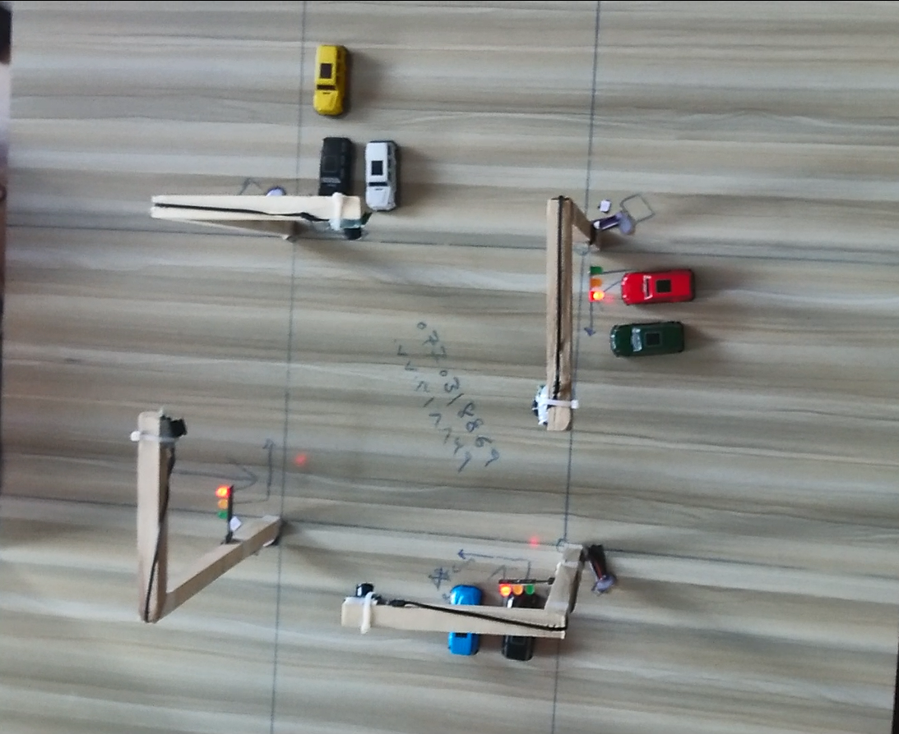

# AI Traffic Light Controller 🚦🤖

This project implements a basic **AI-powered traffic light control system** using computer vision, Python, and socket communication. It is designed to recognize vehicle presence and dynamically adjust traffic light sequences to improve traffic flow efficiency.


## 🔧 Technologies Used

- Python 3
- OpenCV
- YOLO (You Only Look Once) object detection
- Socket programming (TCP)
- Raspberry Pi compatible

## 🚀 How It Works

1. **Object Detection:** The client uses a webcam or camera module to detect vehicles using YOLO.
2. **Socket Communication:** Sends vehicle data to the server Raspberry Pi.
3. **Traffic Light Control:**Raspberry Pi Server adjusts traffic light states based on received data.
4. **Dynamic Light Management:** Light durations change based on vehicle density.

## 📸 Screenshots

  
*(Optional: Replace with an image showing system in action)*

## 🛠 Installation & Usage

1. Clone the repository:
   ```bash
   git clone https://github.com/karim-farhang/ai-traffic-light-controller.git
   cd ai-traffic-light-controller

